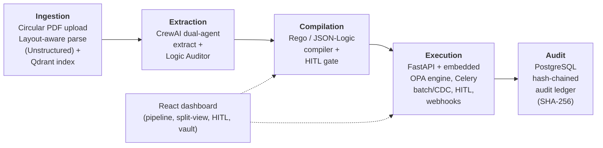

# RegEngine AI

**RegEngine AI turns a SEBI Master Circular PDF into an executable, auditable compliance control** — from
layout-aware ingestion, through an AI extraction/audit pipeline, into compiled OPA Rego policy, live
transaction enforcement, and a tamper-evident PostgreSQL audit ledger. Every stage that can't be resolved
deterministically — an ambiguous clause, an undecidable transaction — is routed to a human-in-the-loop (HITL)
queue instead of guessed at.



---

## Contents

- [Architecture](#architecture)
- [Repository layout](#repository-layout)
- [Prerequisites](#prerequisites)
- [Quickstart](#quickstart)
- [Configuration](#configuration)
- [API surface](#api-surface)
- [Security](#security)
- [Resiliency](#resiliency)
- [Frontend dashboard](#frontend-dashboard)
- [Testing](#testing)
- [Production notes](#production-notes)

---

## Architecture

| Stage | Module | What it does |
|---|---|---|
| **Ingestion** | `app.parsing`, `app.vectorstore` | Layout-aware PDF parsing (Unstructured `hi_res`, Tika fallback), clause-level chunking with content hashing, embedding + Qdrant indexing. |
| **Extraction** | `app.agents` | CrewAI dual-agent pipeline (Claude): an **Extraction Agent** structures each clause into obligations/thresholds/entities, and a **Logic Auditor Agent** independently verifies extraction fidelity before anything is trusted downstream. |
| **Compilation** | `app.compiler` | Compiles audited, deterministic clauses into **OPA Rego** and a **JSON-Logic** fallback. Clauses that are qualitative, ambiguous, low-confidence, or internally conflicting are never silently compiled — they're flagged (`HITLFlag`, blocking or advisory) and routed for human review instead. |
| **Execution** | `app.execution` | FastAPI service that evaluates live broker transactions against compiled policy via a co-located OPA server, returning `allow` / `deny` / `flagged` in real time. A two-layer cache (in-process `PolicyCache` in front of a Redis `PolicyRegistry`) gives sub-millisecond `entity_type -> applicable policies` lookups; a Redis pub/sub `PolicyHotReloadSubscriber` running in every worker hot-reloads OPA and invalidates that cache the instant a compliance officer approves a policy — zero downtime, no restart. Legacy SFTP batch files and DB CDC events are processed asynchronously on Celery/Redis queues. Ambiguous transactions (missing/undefined facts) fall back to a Redis-backed HITL queue, with resolution delivered back via signed webhook. |
| **Audit** | `app.ledger` | Every compliance evaluation is written to a PostgreSQL **append-only, SHA-256 hash-chained ledger** (AWS QLDB–style journal model), binding each transaction to the exact SEBI circular/clause hash that decided it. A verifier recomputes the chain over any time range and reports the first tampered block, if any. |
| **Dashboard** | `frontend/` | React + Tailwind UI: PDF upload with pipeline progress, raw-clause/Rego split view, HITL compliance review queue, and a live transaction audit vault with an on-demand chain-integrity check. |

## Repository layout

```
app/
  parsing/          PDF extraction, chunking, hashing
  vectorstore/      Embeddings + Qdrant indexing
  agents/           CrewAI extraction / audit agents, prompts, schemas
  compiler/         Rego + JSON-Logic compilers, naming conventions, HITL flagging
  execution/        FastAPI-facing evaluator, OPA client, policy registry,
                    Celery tasks (batch/CDC/webhooks), HITL queue
  ledger/           Hash-chain primitives, LedgerService, verifier, CLI
  db/               Base/session for the main schema; ORM models (circulars, clauses,
                    compiled_rules, hitl_reviews)
  api/              HTTP routers (circulars, execution)
  main.py           FastAPI app assembly
  config.py         Centralized environment-driven settings
sql/
  ledger_schema.sql   PostgreSQL DDL for the audit ledger (immutability triggers, grants)
migrations/         Alembic environment + versioned schema migrations
alembic.ini
frontend/
  src/components/   pipeline, splitview, hitl, vault, layout, shared
tests/              pytest suite (compiler, agents, parsing, ledger)
requirements.txt
```

## Prerequisites

| Dependency | Used for | Notes |
|---|---|---|
| Python 3.11+ | Backend service | |
| Node.js 18+ | `frontend/` dashboard | |
| [Open Policy Agent](https://www.openpolicyagent.org/docs/latest/#running-opa) (`opa`) | Embedded policy evaluation | Run as a local/sidecar server: `opa run --server` |
| PostgreSQL 14+ | Audit ledger | Apply `sql/ledger_schema.sql` |
| Redis 6+ | Celery broker/backend, policy registry, HITL queue | |
| Qdrant | Vector index for parsed clauses | Local (`docker run qdrant/qdrant`) or hosted |


## Quickstart

### 1. Backend

```bash
python -m venv .venv
source .venv/bin/activate        # Windows: .venv\Scripts\activate
pip install -r requirements.txt

cp .env.example .env             # see Configuration below
uvicorn app.main:app --reload --port 8000
```

### 2. Policy engine

```bash
opa run --server --addr localhost:8181
```
Compiled Rego is published to this server at runtime via `app.execution.publisher` (OPA's Policy API — no
restart required per policy update).

### 3. Audit ledger (PostgreSQL)

```bash
psql "$LEDGER_ADMIN_DSN" -f sql/ledger_schema.sql
```
This creates the append-only table, its immutability triggers, and the commented-out least-privilege role
grants — uncomment and run those once per environment with your actual application role name. Apply this
**before** running Alembic migrations below, since one of them alters this table.

### 3b. Main schema (circulars / clauses / compiled_rules / hitl_reviews)

```bash
alembic upgrade head
```
Reads its target database from `database_url` (`app/config.py` / `.env`), not `alembic.ini`. Add
`-x sqlalchemy_url=...` to target a different database ad hoc.

### 4. Async workers (batch / CDC / webhooks)

```bash
celery -A app.execution.celery_app worker \
  -Q regengine_batch,regengine_cdc,regengine_webhooks -l info
```

### 5. Frontend dashboard

```bash
cd frontend
npm install
npm run dev          # http://localhost:5173, proxies /v1/* to :8000
```

## Configuration

All settings are environment-driven (`app/config.py`, loaded from `.env` in local dev). Every value below has
a working local-dev default — nothing is required to boot the service against localhost dependencies except
`ANTHROPIC_API_KEY`.

| Variable | Default | Purpose |
|---|---|---|
| `qdrant_url` / `qdrant_api_key` / `qdrant_collection` | `http://localhost:6333` / — / `sebi_master_circulars` | Vector store for parsed clauses |
| `extraction_backend` / `unstructured_strategy` | `unstructured` / `hi_res` | PDF layout extraction backend |
| `max_upload_mb` / `parse_timeout_seconds` / `parse_concurrency` | `50` / `180` / `4` | Ingestion limits |
| `opa_server_url` / `opa_request_timeout_seconds` | `http://localhost:8181` / `2.0` | Embedded OPA engine endpoint |
| `redis_url` | `redis://localhost:6379/0` | Celery broker/backend, policy registry, HITL queue |
| `policy_registry_key` / `hitl_key_prefix` | `regengine:policy_registry` / `regengine:hitl` | Redis key namespacing |
| `policy_cache_ttl_seconds` | `30.0` | L1 `PolicyCache` staleness safety net — pub/sub invalidation is the primary mechanism (`app/execution/policy_hot_reload.py`) |
| `otel_enabled` / `otel_exporter_otlp_endpoint` | `True` / — | Distributed tracing (`app/observability/tracing.py`); unset endpoint falls back to stdout (`ConsoleSpanExporter`) |
| `metrics_enabled` | `True` | Prometheus scrape endpoint at `GET /metrics` (`app/observability/metrics.py`) |
| `celery_batch_queue` / `celery_cdc_queue` / `celery_webhook_queue` | `regengine_batch` / `regengine_cdc` / `regengine_webhooks` | Queue names, scaled independently |
| `celery_agents_queue` / `celery_compiler_queue` / `celery_vectorstore_queue` | `regengine_agents` / `regengine_compiler` / `regengine_vectorstore` | LLM extraction, compilation, and vector-DB indexing background tasks (`app/agents/tasks.py`, `app/compiler/tasks.py`, `app/vectorstore/tasks.py`) |
| `dlq_key_prefix` | `regengine:dlq` | Dead-Letter Queue storage (`app/resilience/dead_letter_queue.py`) |
| `retry_max_attempts_network` / `retry_max_attempts_pipeline` | `5` / `3` | Attempt budget before a transient failure gives up and routes to the DLQ (`app/resilience/retry_policy.py`) |
| `webhook_hmac_secret` | — | Signs outbound OMS/RMS/broker webhooks (`X-RegEngine-Signature-256`) |
| `webhook_timeout_seconds` / `webhook_max_retries` | `5.0` / `5` | Outbound delivery tuning |
| `ledger_database_url` | `postgresql+asyncpg://...@localhost:5432/regengine` | Audit ledger connection (use the least-privilege `regengine_ledger_writer` role — see `sql/ledger_schema.sql`) |
| `ledger_pool_size` | `10` | Ledger connection pool size |
| `database_url` | `postgresql+asyncpg://...@localhost:5432/regengine` | Main schema connection (circulars/clauses/compiled_rules/hitl_reviews); ordinary-privilege role, distinct from the ledger's |
| `database_pool_size` | `10` | Main schema connection pool size |
| `jwt_algorithm` / `jwt_issuer` / `jwt_audience` | `HS256` / `regengine-ai` / `regengine-ai-api` | Self-issued token settings — see [Security](#security) |
| `jwt_external_issuer` / `jwt_jwks_url` | — | Verify SSO-issued human tokens via JWKS instead of a local secret |
| `secrets_backend` | `env` | `env` \| `aws` \| `vault` — where key material actually resolves from (`app/security/secrets.py`) |
| `enforce_https` | `False` | Reject non-TLS requests (`X-Forwarded-Proto`); enable once behind a TLS-terminating ingress |
| `rate_limit_requests_per_window` / `rate_limit_window_seconds` | `300` / `60` | Per-tenant/per-user/per-IP request quota |
| `payload_encryption_enabled` | `False` | Opt-in AES-256-GCM body encryption on top of TLS (`X-Encrypted: true`) |

See `app/config.py` for the complete, authoritative list.

## API surface

**Circulars** (`app/api/routes.py`)
| Method | Path | Purpose |
|---|---|---|
| `POST` | `/v1/circulars/parse` | Upload a PDF, get layout-aware clause chunks |
| `POST` | `/v1/circulars/index` | Embed + upsert chunks into Qdrant |
| `POST` | `/v1/circulars/parse-and-index` | Both steps in one call |
| `GET` | `/healthz` | Liveness |
| `GET` | `/metrics` | Prometheus scrape endpoint (`app/observability/metrics.py`) — network-restricted, not auth-gated |

**Execution** (`app/api/execution_routes.py`, prefix `/v1/execution`) — requires `Broker_API_Client` or `System_Admin`
unless noted
| Method | Path | Purpose |
|---|---|---|
| `POST` | `/transactions/evaluate` | Synchronous `allow` / `deny` / `flagged` decision + ledger write |
| `POST` | `/batches` | Enqueue an SFTP-sourced batch (Celery, `regengine_batch`) |
| `GET` | `/batches/{batch_id}` | Batch job status/results |
| `POST` | `/cdc/events` | Receiver for Debezium/Kafka-Connect/DB-trigger change events |
| `GET` | `/hitl/cases` | List pending HITL cases — `Compliance_Officer` or `System_Admin` |
| `GET` | `/hitl/cases/{case_id}` | Fetch one case — `Compliance_Officer` or `System_Admin` |
| `POST` | `/hitl/cases/{case_id}/resolve` | Resolve an ambiguous transaction — `Compliance_Officer` only |

**Auth** (`app/api/auth_routes.py`, prefix `/v1/auth`)
| Method | Path | Purpose |
|---|---|---|
| `POST` | `/token` | OAuth2 `client_credentials` grant — issues a `Broker_API_Client` token for a registered tenant |
| `GET` | `/me` | Introspect the caller's own resolved identity |

**HITL review portal** (`app/api/hitl_review_routes.py`, prefix `/v1/hitl-reviews`) — policy-level HITL (approving
a *compiled policy version*, distinct from `/v1/execution/hitl/cases` which resolves a *live transaction*)
| Method | Path | Purpose |
|---|---|---|
| `GET` | `/` | List reviews — `Compliance_Officer` or `System_Admin` |
| `GET` | `/{review_id}` | Fetch one review — `Compliance_Officer` or `System_Admin` |
| `POST` | `/{review_id}/approve` | Activate the compiled policy — `Compliance_Officer` only |
| `POST` | `/{review_id}/reject` | Refuse it — `Compliance_Officer` only |

**Dead-Letter Queue admin** (`app/api/dlq_routes.py`, prefix `/v1/admin/dlq`) — `System_Admin` only (see that
module's docstring on why "compliance engineer" maps to this role, not `Compliance_Officer`)
| Method | Path | Purpose |
|---|---|---|
| `GET` | `/` | List DLQ entries, filterable by `category`/`status_filter`, paginated |
| `GET` | `/stats` | Counts by category/status |
| `GET` | `/{entry_id}` | Inspect one failed item's payload/error/traceback |
| `PATCH` | `/{entry_id}` | Edit the failing parameters before requeueing |
| `POST` | `/{entry_id}/requeue` | Re-dispatch the (possibly edited) item back into its originating Celery task |
| `POST` | `/{entry_id}/discard` | Mark not worth reprocessing (e.g. a duplicate) |
| `POST` | `/{entry_id}/resolve` | Mark confirmed fixed |

Interactive docs: `http://localhost:8000/docs` once the service is running.

**Audit ledger verification** (CLI, not HTTP — designed for scheduled compliance jobs):
```bash
python -m app.ledger.verify_cli --start 2026-01-01 --end 2026-01-31
```
Prints a JSON `ChainVerificationResult` and exits non-zero on any detected break.

## Security

OAuth2/JWT authentication and RBAC (`app/security/`) — see that package's module docstrings for full design
rationale.

**Roles**
| Role | Identity type | Can |
|---|---|---|
| `Compliance_Officer` | Human, enterprise SSO | Approve/reject compiled policies and resolve ambiguous transactions (HITL) |
| `Broker_API_Client` | Machine, one per broker tenant | Submit/read transactions, batches, and CDC events for its own `tenant_id` |
| `System_Admin` | Human or service account | Trigger ingestion, parse/index circulars, operational execution access — deliberately **excluded** from HITL approval (separation of duties) |

**Tokens**: `Broker_API_Client` tokens are self-issued via `POST /v1/auth/token` (RFC 6749 `client_credentials`);
`Compliance_Officer`/`System_Admin` tokens come from your enterprise SSO provider, verified via JWKS
(`jwt_jwks_url`) — this service never sees a human's password. Broker tenant clients are registered out-of-band
via `app.security.tenant_store.TenantClientStore` (no public self-service signup).

**Middleware stack** (`app/security/middleware.py`), mounted in this order: `SecurityHeadersMiddleware` (HSTS +
HTTPS enforcement) → `JWTAuthenticationMiddleware` (opportunistic — attaches `request.state.principal`, never
itself 401s) → `TenantRateLimitMiddleware` (Redis fixed-window, keyed by `tenant_id` so one broker's burst can't
starve another's quota) → `PayloadEncryptionMiddleware` (optional AES-256-GCM body encryption on top of TLS, opt
in via `X-Encrypted: true`). Actual 401/403 enforcement is per-route via `app.security.dependencies.require_roles(...)`.

**Secrets** (`app/security/secrets.py`): JWT signing keys, per-tenant payload-encryption keys, and other key
material resolve through `SECRETS_BACKEND` (`env` for local dev, `aws` for AWS Secrets Manager, `vault` for
HashiCorp Vault KV v2) rather than being read as plain settings in production — swap the backend, no other code
changes.

## Resiliency

Automated failure recovery for the pipeline's edge cases (`app/resilience/`) — see that package's module
docstrings for full design rationale.

**Classification, not just detection**: every failure is classified via `is_transient(exc)`
(`app/resilience/retry_policy.py`), which walks the exception's `__cause__` chain looking for a
network/connectivity type (`httpx.TransportError`, `ConnectionError`, `TimeoutError`, ...). Transient failures
are retried with Celery's native exponential-backoff-with-full-jitter (`retry_backoff`/`retry_backoff_max`/
`retry_jitter` task options), bounded by `retry_max_attempts_network` (RSS polling, vector DB ingestion) or
`retry_max_attempts_pipeline` (PDF parsing, LLM extraction). Non-transient failures — a genuinely unparseable
PDF, a clause the LLM agent cannot structure, a malformed JSON-Logic AST — go straight to the DLQ with zero
retries spent, since a retry cannot fix them.

**DLQ-integrated Celery tasks**: `app/ingestion/tasks.py` (PDF parsing, RSS polling), `app/agents/tasks.py` (LLM
extraction), `app/compiler/tasks.py` (compilation — the JSON-Logic AST is structurally validated in
`app/compiler/jsonlogic_validator.py`, called from `app.compiler.pipeline.compile_audited_rule` itself so the
guarantee holds regardless of caller), and `app/vectorstore/tasks.py` (Qdrant indexing). Each isolated onto its
own Celery queue so a slow LLM call can never block ingestion or compilation.

**Admin API**: see [DLQ admin](#api-surface) above — inspect a failed item's payload/traceback, edit its failing
parameters, and requeue it back into the exact task it fell out of (`celery_app.send_task` by name, so one
generic endpoint handles every DLQ-routed task type).

## Frontend dashboard

Four views, backed today by `frontend/src/mock/mockData.js` (shaped 1:1 to the backend Pydantic models, so
swapping mock state for `fetch()` calls is a data-layer change, not a component rewrite):

- **Pipeline** — PDF upload + ingestion → extraction → verification → compilation tracker
- **Split View** — raw legal text beside its compiled Rego, with linked clause/code highlighting
- **HITL Review** — compliance-officer queue for compiler-flagged clauses and undecidable live transactions
- **Audit Vault** — live transaction feed with clause-hash links and an on-demand chain-integrity check

```bash
cd frontend && npm run build     # production bundle -> frontend/dist/
```

## Testing

```bash
pytest -q
```

Covers the Rego/JSON-Logic compiler and HITL flagging (`test_compiler.py`), CrewAI tool schemas
(`test_agents_tools.py`), PDF parsing (`test_parsing.py`), and the audit ledger's append/verify/tamper-detection
behavior against a real database engine (`test_ledger.py`, SQLite in-process — the hash-chain logic is
DB-agnostic; `pg_advisory_xact_lock` concurrency control is exercised only against real PostgreSQL).

## Production notes

- **Ledger immutability is defense-in-depth, not one mechanism**: an `UPDATE`/`DELETE` trigger, least-privilege
  role grants (INSERT+SELECT only), and the hash chain itself all have to be bypassed simultaneously to rewrite
  history undetected. Apply the commented `GRANT`/`REVOKE` block in `sql/ledger_schema.sql` for your actual
  application role before going live.
- **A ledger outage never blocks a live compliance decision** — `POST /transactions/evaluate` logs the audit
  entry best-effort and returns the decision regardless. If your compliance posture requires "no evaluation
  without an audit row," put a durable outbox in front of `LedgerService.append_entry` (see
  `app/ledger/integration.py`).
- **Secrets**: `ledger_database_url` and `webhook_hmac_secret` should come from your
  secrets manager in any non-local environment, never a committed `.env`.
- **Webhook receivers** should verify the `X-RegEngine-Signature-256` HMAC header before trusting a decision
  notification.
- **Scaling**: `regengine_batch`, `regengine_cdc`, and `regengine_webhooks` are separate Celery queues so a
  large SFTP batch can't starve latency-sensitive webhook delivery — scale worker pools per queue
  independently.
