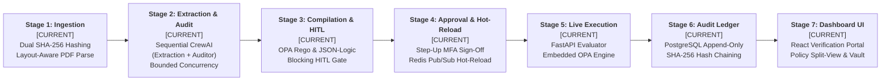
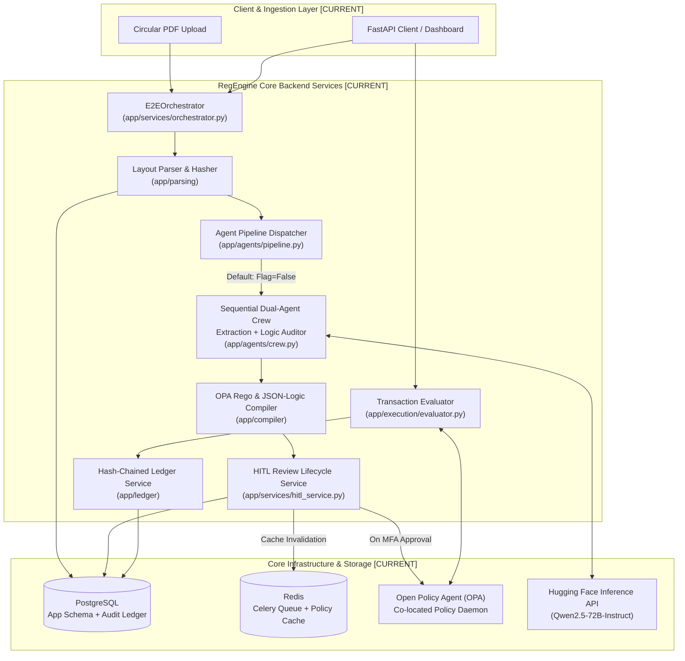
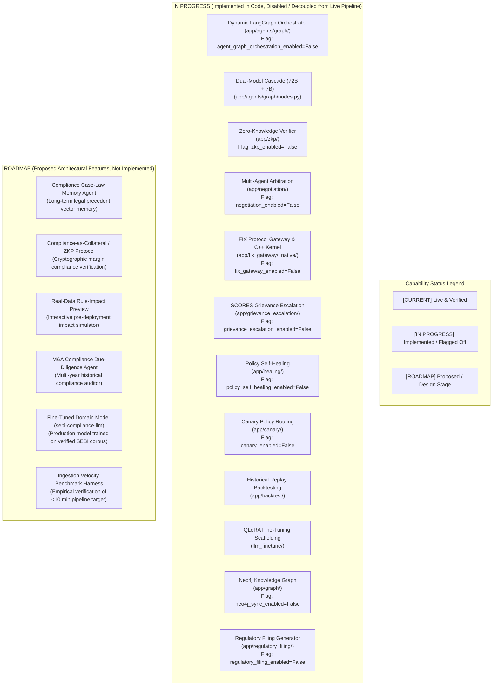

# RegEngine AI — Product Requirements Document (PRD)

**Document Version:** 2.0  
**Status:** Canonical Product Requirements Specification  
**Classification:** Open Architecture & Engineering Specification  

---

## 1. Product Overview & Problem Statement

### 1.1 Executive Summary
RegEngine AI is a deterministic regulatory intelligence and policy enforcement platform designed specifically for financial market intermediaries governed by the Securities and Exchange Board of India (SEBI). The platform ingests complex regulatory circulars (PDFs), extracts machine-readable obligations and quantitative thresholds under bounded concurrency, compiles them into executable Open Policy Agent (OPA) Rego policies, evaluates live broker transactions in low single-digit milliseconds via synchronous REST (with sub-millisecond in-process L1 policy cache lookups and native C++ kernel evaluation), and records every evaluation into a tamper-evident, append-only PostgreSQL audit ledger.

### 1.2 The Core Problem
Financial intermediaries (stockbrokers, asset management companies, depositories, clearing corporations) face substantial operational risk due to the latency and subjectivity of manual compliance interpretation:
- **Manual Interpretation Delays**: When SEBI issues a Master Circular or urgent circular amendment, compliance officers and legal desks typically take days to manually analyze cross-references, calculate margin multipliers, and distribute revised desk manuals.
- **Inconsistent Execution Across Desks**: Human interpretation differences between trading desks, risk managers, and compliance teams lead to asymmetric compliance enforcement and costly audit exceptions.
- **Absence of Cryptographic Traceability**: Traditional compliance tracking relies on decentralized emails, spreadsheets, and internal ticketing systems that cannot cryptographically prove which regulatory clause governed a specific transaction decision.

### 1.3 Core Product Solution
RegEngine AI eliminates manual latency and interpretation drift by translating natural-language regulatory circulars into deterministic code. Any clause that contains ambiguity, conflicting thresholds, or qualitative language is strictly halted at a **Human-in-the-Loop (HITL)** approval gate, preventing unverified or hallucinated rules from entering production.

---

## 2. Capability Status Taxonomy

To maintain absolute architectural integrity and prevent roadmap ambitions from being misconstrued as live capabilities, every feature, subsystem, and component in RegEngine AI is classified under one of three strict capability statuses:

| Status | Definition | Criteria Required for Classification |
|---|---|---|
| **`CURRENT`** | Implemented, integrated into the live pipeline, and verified end-to-end. | • Complete production code present in `app/` • Directly executed by live API routes, Celery workers, or orchestrator • Covered by automated end-to-end (E2E) and integration test suites • Fully operational out-of-the-box in production or offline mode |
| **`IN PROGRESS`** | Implementation exists but is not fully integrated, disabled by feature flag, or not end-to-end verified. | • Source code present in repository (e.g., experimental module or feature-flagged layer) • Decoupled from the default startup/runtime path (dormant feature flag or frozen) • Unit/smoke tests may exist in isolation, but lacks live end-to-end verification • Not executed during standard production transaction evaluation |
| **`ROADMAP`** | Proposed, conceptual, or architectural design; not implemented in code. | • Architectural proposal, specification, or design document • Zero production implementation or only placeholder fixtures/mock interfaces • No live pipeline execution or end-to-end test verification • Subject to future research, dataset curation, or benchmark verification |

> [!IMPORTANT]
> **Strict PRD Boundary Rule**: No `ROADMAP` capability and no feature-flagged `IN PROGRESS` capability documented in Section 8 may be described in Sections 1 through 7 as an existing production capability. Sections 1 through 7 document exclusively the live, verified production platform.

---

## 3. Core Regulatory-Compliance Pipeline (Stages 1–7) [`CURRENT`]

The live, active production pipeline consists of seven sequential, deterministic stages. Every stage is implemented, integrated into the core application, and verified via automated test suites:

### Stage 1: Layout-Aware Ingestion & Dual Cryptographic Hashing [`CURRENT`]
- **Modules**: `app/parsing/extractor.py`, `app/parsing/hashing.py`, `app/storage/object_store.py`
- **Functionality**:
  - Ingests circular PDFs via local filesystem (`STORAGE_BACKEND=local`) or S3-compatible object storage (`STORAGE_BACKEND=s3`).
  - Computes two distinct SHA-256 digests immediately upon upload:
    1. `source_document_sha256`: Computed over raw uploaded PDF bytes prior to any processing.
    2. `extracted_text_sha256`: Computed over normalized extracted text.
  - Extracts layout-aware clauses using Unstructured with Apache Tika and OCR fallbacks, chunking text into clause units.
  - State Transition: `UPLOADED` &rarr; `INGESTED`.
- **Verification**: Verified by `tests/test_document_hashing.py` and `tests/test_parsing.py`.

### Stage 2: Dual-Agent Extraction & Logic Audit [`CURRENT`]
- **Modules**: `app/agents/crew.py`, `app/agents/pipeline.py`, `app/agents/providers.py`
- **Functionality**:
  - Executes fixed two-agent sequential validation using CrewAI:
    1. **Extraction Agent**: Prompts primary open-weight model (`Qwen/Qwen2.5-72B-Instruct` via Hugging Face Inference or deterministic `OfflineLLMProvider`) to extract obligations, entities, and numerical parameters.
    2. **Logic Auditor Agent**: Independently re-evaluates the extracted rule against the verbatim clause text, validating consistency and checking for hallucinations.
  - Bounded concurrency governed by `EXTRACTION_CONCURRENCY` (default 4) to prevent memory and API token rate exhaustion.
  - State Transition: `INGESTED` &rarr; `EXTRACTING` &rarr; `EXTRACTED`.
- **Verification**: Verified by `tests/test_agent_providers.py` and `tests/test_e2e_pipeline.py`.

### Stage 3: Deterministic Policy Compilation & HITL Flagging [`CURRENT`]
- **Modules**: `app/compiler/rego_compiler.py`, `app/compiler/jsonlogic_compiler.py`, `app/compiler/hitl.py`
- **Functionality**:
  - Compiles audited compliance rules into production **OPA Rego** packages (`data.<regulator>.<domain>.circulars.<slug>`).
  - Generates structural **JSON-Logic** Abstract Syntax Trees (ASTs) for non-OPA consumers.
  - Inspects extracted rules for qualitative obligations, low auditor confidence, or conflicting parameters; automatically generates `HITLReview` records in PostgreSQL.
  - Rules with pending reviews remain strictly blocked in `AWAITING_HITL` state; active rule count remains 0.
  - State Transition: `EXTRACTED` &rarr; `COMPILING` &rarr; `AWAITING_HITL`.
- **Verification**: Verified by `tests/test_compiler.py` and `tests/test_hitl_approval_gate.py`.

### Stage 4: Compliance Officer Approval & Zero-Downtime Hot-Reload [`CURRENT`]
- **Modules**: `app/services/hitl_service.py`, `app/execution/policy_publisher.py`, `app/execution/policy_hot_reload.py`
- **Functionality**:
  - Authorizes Compliance Officers to inspect rule diffs, verbatim source evidence, and auditor findings.
  - Requires Step-Up MFA authentication claims (`amr=["pwd", "mfa"]`) for all approval/rejection actions.
  - Approving all pending reviews for a circular promotes the rules to active status (`DEPLOYED`).
  - Publishes policies to the OPA server over HTTP and broadcasts a cache invalidation signal via Redis pub/sub (`policy_events`).
  - Worker pods invalidate local in-process L1 policy caches without container restart.
  - State Transition: `AWAITING_HITL` &rarr; `APPROVED` &rarr; `DEPLOYED`.
- **Verification**: Verified by `tests/test_policy_cache_and_hot_reload.py` and `tests/test_api_error_handling.py`.

### Stage 5: High-Throughput Live Transaction Evaluation [`CURRENT`]
- **Modules**: `app/execution/evaluator.py`, `app/execution/opa_engine.py`, `app/api/execution_routes.py`
- **Functionality**:
  - Exposes synchronous REST endpoint `POST /v1/execution/transactions/evaluate`.
  - Resolves active policies for the submitting entity type (`Stockbroker`, `AMC`, etc.) via two-tier cache (in-process L1 + Redis L2).
  - Evaluates broker transaction payloads against active OPA Rego policies, returning deterministic `allow`, `deny`, or `flagged` outcomes.
  - In the event of a `deny` outcome, cites the exact SEBI clause reference and violation detail.
- **Verification**: Verified by `tests/test_opa_execution.py`.

### Stage 6: Cryptographic Append-Only Audit Ledger [`CURRENT`]
- **Modules**: `app/ledger/hash_chain.py`, `app/ledger/service.py`, `app/ledger/verifier.py`, `app/ledger/verify_cli.py`, `sql/ledger_schema.sql`
- **Functionality**:
  - Implemented natively in PostgreSQL using append-only, SHA-256 hash-chained journal blocks following a QLDB-journal-inspired design per [ADR-0003](docs/adr/0003-sha256-hash-chain-audit-log.md) (requires zero AWS QLDB dependencies).
  - Every transaction evaluation appends an immutable record binding:
    - Transaction identifier and broker code
    - Evaluation outcome (`PASS`, `FAIL`, `HITL_REVIEW`)
    - Exact `source_document_sha256` and `clause_hash` governing the evaluation
    - `previous_hash`, `payload_digest`, and block `current_hash`
  - Database-level PostgreSQL triggers strictly prevent `UPDATE` and `DELETE` operations.
  - Includes an on-demand audit verification CLI (`python -m app.ledger.verify_cli`) that recomputes the hash chain to detect tampering.
- **Verification**: Verified by `tests/test_ledger.py` and `tests/test_vault_integrity.py`.

### Stage 7: Compliance IDE & Verification Portal [`CURRENT`]
- **Modules**: `frontend/` (React + Vite + Tailwind CSS)
- **Functionality**:
  - Interactive web interface communicating directly with backend REST endpoints:
    - **Circular Ingestion Tracker**: Real-time progress across pipeline stages.
    - **Policy Split-View**: Side-by-side legal clause text and compiled OPA Rego code.
    - **HITL Review Portal**: Review queue with auditor rationales and approval buttons.
    - **Transaction Evaluation Playground**: Test simulator running client-side OPA Wasm or backend evaluation.
    - **Audit Vault**: Searchable, tamper-evident ledger viewer with chain verification.
- **Verification**: Verified by frontend build compilation (`npm run build`) and integration route tests (`tests/test_api.py`).

---

## 4. Live Production Architecture & Execution Path [`CURRENT`]

### Execution Path Guarantees:
1. **Primary LLM**: In production environments (`LLM_PROVIDER=huggingface`), all live extraction and auditing calls execute against `Qwen/Qwen2.5-72B-Instruct`. In local/air-gapped environments (`LLM_PROVIDER=offline`), calls execute against deterministic regex extractors.
2. **Sequential Crew Execution**: Dual-agent extraction operates as a fixed linear sequence: `Extraction Agent` &rarr; `Logic Auditor Agent` with up to 2 revision loops upon auditor rejection.
3. **Absence of Cloud Dependencies**: Core pipeline execution requires no proprietary cloud LLM APIs (OpenAI, Anthropic), no cloud vector databases, and no cloud-managed ledger services.

---

## 5. Complete Subsystem & Capability Classification Matrix

Every subsystem across the RegEngine AI codebase is cataloged below with its explicit capability status:

| Subsystem / Capability | Directory / File Path | Status | Live Pipeline? | Evidence in Code | E2E Verified? |
|---|---|:---:|:---:|---|:---:|
| **Document Ingestion & Dual Hashing** | `app/parsing/`, `app/storage/` | **`CURRENT`** | **Yes** | `extractor.py`, `hashing.py`, `object_store.py` | **Yes** |
| **Sequential Dual-Agent Extraction** | `app/agents/crew.py`, `providers.py` | **`CURRENT`** | **Yes** | `run_dual_validation()`, `HuggingFaceProvider` / `OfflineLLMProvider` | **Yes** |
| **Taxonomy & Canonical Fact Binding** | `app/regulatory/` | **`CURRENT`** | **Yes** | `taxonomy.py`, `facts.py` | **Yes** |
| **Policy Compilation (Rego/AST)** | `app/compiler/` | **`CURRENT`** | **Yes** | `rego_compiler.py`, `jsonlogic_compiler.py` | **Yes** |
| **HITL Review Gate & Step-Up MFA** | `app/services/hitl_service.py` | **`CURRENT`** | **Yes** | `hitl_service.py`, `app/api/hitl_review_routes.py` | **Yes** |
| **Policy Registry & Hot-Reload** | `app/execution/policy_*` | **`CURRENT`** | **Yes** | `policy_publisher.py`, `policy_hot_reload.py` | **Yes** |
| **Synchronous OPA Evaluation** | `app/execution/evaluator.py` | **`CURRENT`** | **Yes** | `evaluator.py`, `opa_engine.py` | **Yes** |
| **Append-Only SHA-256 Audit Ledger** | `app/ledger/` | **`CURRENT`** | **Yes** | `hash_chain.py`, `service.py`, `verifier.py`, `sql/ledger_schema.sql` | **Yes** |
| **Compliance IDE & Dashboard** | `frontend/` | **`CURRENT`** | **Yes** | React components wired to REST endpoints | **Yes** |
| **Dynamic LangGraph Orchestration** | `app/agents/graph/` | **`IN PROGRESS`** | **No** | `graph.py`, `nodes.py`, `complexity_router.py` (flagged off) | **No** (stubs only) |
| **Dual-Model Cascade (72B + 7B)** | `app/agents/graph/nodes.py` | **`IN PROGRESS`** | **No** | `fallback_extraction_node`, `agent_fallback_model` | **No** |
| **QLoRA Fine-Tuning Scaffolding** | `llm_finetune/` | **`IN PROGRESS`** | **No** | `train_qlora.py`, `dataset/sample_artifacts.py` | **No** (smoke fixtures) |
| **Zero-Knowledge Proofs (ZKP)** | `app/zkp/` | **`IN PROGRESS`** | **No** | `groth16_verifier.py`, `verification_service.py` (`zkp_enabled=False`) | **No** |
| **Multi-Agent Arbitration** | `app/negotiation/` | **`IN PROGRESS`** | **No** | `consensus.py`, `arbiter.py` (`negotiation_enabled=False`) | **No** |
| **Historical Policy Backtesting** | `app/backtest/` | **`IN PROGRESS`** | **No** | `replay_engine.py`, `app/api/backtest_routes.py` | **No** |
| **FIX Protocol Gateway & C++ Kernel** | `app/fix_gateway/`, `native/` | **`IN PROGRESS`** | **No** | `fix_gateway.h`, QuickFIX wrapper (`fix_gateway_enabled=False`) | **No** |
| **SCORES Grievance Escalation** | `app/grievance_escalation/` | **`IN PROGRESS`** | **No** | `escalation_engine.py` (`grievance_escalation_enabled=False`) | **No** |
| **Autonomous Policy Self-Healing** | `app/healing/` | **`IN PROGRESS`** | **No** | `repair_agent.py` (`policy_self_healing_enabled=False`) | **No** |
| **Shadow Canary Policy Routing** | `app/canary/` | **`IN PROGRESS`** | **No** | `traffic_splitter.py` (`canary_enabled=False`) | **No** |
| **Regulatory Filing Adapter** | `app/regulatory_filing/` | **`IN PROGRESS`** | **No** | `filing_generator.py` (`regulatory_filing_enabled=False`) | **No** |
| **Multilingual OCR & Translation** | `app/localization/`, `translation_parity/` | **`IN PROGRESS`** | **No** | `translation.py` (`localization_enabled=False`) | **No** |
| **Legal Knowledge Graph (Neo4j)** | `app/graph/` | **`IN PROGRESS`** | **No** | `neo4j_client.py` (`neo4j_sync_enabled=False`) | **No** |
| **Real-Time Incident Streaming** | `app/incident/` | **`IN PROGRESS`** | **No** | `publisher.py` (`incident_broadcast_enabled=False`) | **No** |
| **Regulatory Version Diffing** | `app/diffing/` | **`IN PROGRESS`** | **No** | `differ.py`, `app/api/diffing_routes.py` | **No** |
| **Multi-Regulator Extensions** | `policies/rbi/`, `irdai/`, `pfrda/` | **`IN PROGRESS`** | **No** | Example Rego bundles; core restricted to SEBI | **No** |
| **Fine-Tuned SEBI Domain Model** | `sebi-compliance-llm` | **`ROADMAP`** | **No** | Conceptual; referenced in model enum; unweighted | **No** |
| **Compliance Case-Law Memory Agent** | `app/case_law/` | **`CURRENT`** | **No** | Advisory memory agent (`case_law_memory_enabled=True`); tenant-isolated Qdrant indexing of approved HITL reviews only; non-blocking advisory context | **No** |
| **Compliance-as-Collateral Protocol** | N/A | **`ROADMAP`** | **No** | Proposed cryptographic collateral verification protocol | **No** |
| **Real-Data Rule-Impact Preview** | N/A | **`ROADMAP`** | **No** | Proposed live pre-deployment transaction preview | **No** |
| **M&A Compliance Due-Diligence Agent**| `app/mna_due_diligence/` | **`CURRENT`** | **No** | Dual-authorized cross-entity compliance auditor (`POST /v1/mna/compare`); zero-mutation; advisory LLM semantics | **No** |
| **Empirical Ingestion Velocity Benchmark** | `benchmarks/` (planned) | **`ROADMAP`** | **No** | Target: `<10 min`; formal benchmark harness pending | **No** |

---

## 6. Non-Functional Requirements & Security Guarantees [`CURRENT`]

1. **Deterministic Execution**:
   - Machine compliance evaluation must be strictly deterministic. Given identical transaction payloads and active OPA Rego bundles, the evaluation outcome must never vary.
2. **Audit Ledger Immutability**:
   - Every transaction evaluation record written to PostgreSQL `compliance_audit_ledger` is protected by database triggers that reject `UPDATE` and `DELETE` queries.
   - Hash chain continuity is verified cryptographically via SHA-256 over `(previous_hash, payload_digest, sequence_num, evaluated_at)`.
3. **Zero Startup Dependencies for Core Pipeline**:
   - The application boots cleanly with `uvicorn app.main:app` requiring only PostgreSQL, Redis, and OPA. External services (Neo4j, SFTP, SCORES, QuickFIX) are completely bypassed.
4. **Environment-Enforced Security Boundaries**:
   - Setting `DEMO_MODE=true` is strictly prohibited in `staging` and `production` environments; the application crashes at startup if misconfigured.
   - Compliance Officer approval actions strictly require valid Step-Up MFA authentication claims.

---

## 7. Auditability, Verification & Testing Baseline [`CURRENT`]

The platform maintains automated test suites verifying all `CURRENT` capabilities:
- **Unit Testing**: Over 80 isolated unit tests exercising compilers, hashing algorithms, parsing logic, and ledger verification using in-memory databases (`aiosqlite`).
- **Integration Testing**: Validates PostgreSQL advisory locking, Alembic schema migrations, Redis hot-reload pub/sub, and live OPA evaluation.
- **End-to-End Testing**: `tests/test_e2e_pipeline.py` executes the entire pipeline from PDF circular ingestion through extraction, logic audit, Rego compilation, HITL review, and transaction evaluation.

---

## 8. Roadmap, Exploratory & Future Capabilities [`ROADMAP` & `IN PROGRESS`]

The capabilities documented in this section represent planned research, architectural extensions, or feature-flagged experimental modules. **None of the features in this section are active in the live production pipeline.**

### 8.1 Compliance Case-Law Memory Agent [`CURRENT` / Advisory Workflow]
- **Implemented Capability**: `app/case_law/` implements the Compliance Case-Law Memory Agent, providing semantic vector indexing and tenant-isolated retrieval of approved/resolved HITL compliance decisions over Qdrant (`case_law_precedents` collection).
- **Workflow**:
  1. Precedents are indexed exclusively from **APPROVED / RESOLVED** HITL decisions (`app/case_law/indexer.py`); pending, rejected, and unverified outputs are strictly rejected.
  2. Provenance is preserved bit-for-bit: circular reference, source document SHA-256, clause hash, approving officer ID, timestamp, and policy SHA-256.
  3. Strict tenant isolation is enforced at query time: tenant A can never retrieve tenant B's private precedents.
  4. When an ambiguous clause or qualitative directive is flagged for HITL, the agent (`app/case_law/agent.py`) retrieves semantically similar approved precedents to assist the human reviewer.
- **Trust Boundary & Safety Invariants**:
  1. *Current Regulatory Text Supremacy*: Current circular text ALWAYS takes absolute precedence over historical precedent.
  2. *No Automatic Policy Activation*: Precedents are non-binding historical guidance; they can never activate a policy or bypass human approval.
  3. *Conflict Escalation*: If a precedent conflicts with current regulatory text, the agent explicitly flags the conflict for mandatory HITL review rather than choosing automatically.
  4. *No Invention*: Historical precedent is never used to invent thresholds, deadlines, or obligations.
  5. *Untrusted Data Boundary*: Precedent text is treated as untrusted historical data and cannot execute instructions.

### 8.2 Compliance-as-Collateral / Zero-Knowledge Proof of Adherence [`VERIFIED CURRENT`]
- **Implemented Capability**: `app/zkp/` implements the Compliance-as-Collateral / Zero-Knowledge Proof of Adherence capability (PRD Addendum v2 Section 8.2), enabling brokers to cryptographically prove that an evaluated batch of transactions over a reporting period satisfied the approved upfront margin compliance predicate without disclosing proprietary trade amounts, margins, or client account identifiers.
- **Circuit Architecture** (`zk/circuits/compliance_collateral.circom`):
  1. *Predicate*: Evaluates $N$ transactions in an isolated batch, enforcing $\text{collected\_margin}[i] \ge \text{required\_margin}[i]$ via `GreaterEqThan(64)`.
  2. *Commitments*: Computes Poseidon(4) leaf commitments over `(transaction_id, collected_margin, required_margin, salt)` and a Poseidon(N) root dataset commitment.
  3. *Public Inputs*: `[policy_hash, reporting_period_id, dataset_commitment, margin_threshold]`.
  4. *Private Inputs*: `[collected_margin, required_margin, transaction_ids, salts]`.
- **Deterministic Witness Generator** (`app/zkp/witness.py`):
  - Validates that every transaction satisfies $\text{collected} \ge \text{required}$; fails closed with `CompliancePredicateViolationError` immediately if any violation occurs.
  - Implements pure-Python BN254 scalar field Poseidon hashing for deterministic leaf and root commitment calculation.
- **Pure-Python Groth16 Verifier** (`app/zkp/groth16_verifier.py`):
  - Evaluates the standard Groth16 pairing equation $e(\pi_a, \pi_b) == e(\alpha_1, \beta_2) \cdot e(vk_x, \gamma_2) \cdot e(\pi_c, \delta_2)$ over BN254 without external subprocesses or Node/snarkjs toolchain dependencies.
  - Features iterative binary exponentiation (O(1) stack depth) to eliminate recursion limits across Python 3.12+ environments.
- **Verification Service & Public API** (`app/zkp/verification_service.py`, `app/api/zkp_routes.py`):
  - Exposes `POST /v1/zkp/verify-collateral` accepting strictly public proof inputs.
  - Anti-replay protection: Rejects duplicate proof submissions (`proof_hash` deduplication).
  - Fail-closed validation: Asserts that public signals match submitted policy hash, period, and commitment.
  - Ledger evidence: On success, appends an entry to `compliance_audit_ledger` recording `details.compliance_collateral` with proof hash and commitments; strictly omits proprietary trade amounts (`facts`).
- **Trust Boundary & Safety Invariants**:
  1. *Trusted Setup Assumptions*: Groth16 is **NOT** transparent. It relies on a universal Phase 1 ceremony (Powers of Tau) and circuit-specific Phase 2 MPC. Security strictly assumes honest disposal of toxic waste trapdoors.
  2. *Cryptographic vs. Legal Compliance Distinction*: Cryptographic proof verification proves that the prover possessed an arithmetic witness satisfying R1CS constraints; it does **NOT** certify that underlying off-chain accounting data was authentic, complete, or unmanipulated prior to witness generation.
  3. *No Automatic Policy Activation*: Proof verification is an advisory evidence submission mechanism; it **NEVER** automatically activates, deploys, or alters compiled rules (`is_active` remains untouched).
  4. *Strict Multi-Tenancy & Zero Trade Leakage*: Enforces tenant verification at the API boundary; private trade amounts and account identifiers never leave prover infrastructure.

### 8.3 Multi-Agent Negotiation & Arbitration [`IN PROGRESS`]
- **Implemented Capabilities**:
  1. *Clause Extraction & Auditing Arbitration* (`app/negotiation/arbitration_engine.py`): Deliberation protocol between Extractor Agent and Logic Auditor Agent over ambiguous regulatory clauses. Cross-examines arguments against verbatim source quotes, canonical taxonomy (`app/regulatory/facts.py`), and deterministic constraints. Disagreements produce `REVIEW_REQUIRED` and route to HITL. Gated behind `settings.arbitration_enabled=False`.
  2. *Execution-Time Trade Negotiation* (`app/negotiation/orchestrator.py`): Consensus protocol among domain agents (`MarginAgent`, `RiskDisclosureAgent`, `FundSegregationAgent`) to resolve multi-clause compliance outcomes during transaction evaluation. Gated behind `settings.negotiation_enabled=False`.
- **Trust Boundary & Safety Invariants**:
  1. *No Direct Policy Activation*: Arbitration never deploys, activates, or compiles a policy directly; all outputs require standard compiler validation and HITL sign-off.
  2. *Untrusted Data Boundary*: Regulatory PDF text is treated as untrusted user data. Boundary isolation and anti-injection defenses prevent prompt injections from overriding system instructions.
  3. *No Fact Invention*: Arbiter verifies quotes bit-for-bit against source text and canonical fact taxonomy; cannot invent thresholds or obligations.
  4. *Model Heterogeneity & Same-Checkpoint Transparency*: Distinct Arbiter model configuration supported; flags `same_model_risk = True` if identical model checkpoints are used across roles.
  5. *Strict Multi-Tenancy & Provenance*: Sessions and transcripts are partitioned by `tenant_id` and sealed with tamper-evident SHA-256 cryptographic digests.

### 8.4 Real-Data Rule-Impact Preview & Backtesting [`VERIFIED CURRENT`]
- **Implemented Capabilities**:
  1. *Historical Ledger Replay Engine* (`app/backtest/replay_engine.py`): Replays historical order-flow transactions snapshotting `facts` against candidate JSON-Logic ASTs or isolated OPA packages.
  2. *Rule-Impact Preview / Digital Twin* (`app/backtest/orchestrator.py`, `app/api/hitl_review_routes.py`): Interactive on-demand impact preview for candidate `CompiledRule` versions awaiting human approval (`POST /v1/hitl-reviews/{review_id}/preview-impact`). Computes breach deltas, failure rate shifts, aggregate financial impact, and redacted representative examples.
- **Trust Boundary & Safety Invariants**:
  1. *No Production State Mutation*: Replay executes strictly read-only against `compliance_audit_ledger`; candidate rules remain `is_active = False` and are never deployed or published to live OPA.
  2. *Strict Multi-Tenancy*: Replay queries strictly enforce `tenant_id`, preventing cross-tenant trade leakage.
  3. *Advisory Only & Non-Inference*: Zero historical impact does NOT constitute compliance approval and does NOT infer regulatory correctness.
  4. *Reproducibility & Tamper-Evidence*: Datasets and reports are sealed with deterministic cryptographic SHA-256 digests (`dataset_snapshot_hash`, `result_digest`).
  5. *Trade Secrecy & Data Minimization*: Proprietary transaction IDs and PII are redacted and masked from review reports.
- **Digital Twin Scope**: Historical backtesting and impact preview are strictly deterministic replays against immutable historical transaction logs; speculative generative market simulations are explicitly unsupported.

### 8.5 M&A Compliance Due-Diligence Agent [`VERIFIED CURRENT`]
- **Implemented Capability**: An autonomous, read-only compliance due-diligence agent (`app/mna_due_diligence/`, `app/api/mna_routes.py`) that compares compliance configurations, risk overlays, compiled rules, numerical thresholds, statutory obligations, pending HITL reviews, and historical violation profiles belonging to two explicitly authorized regulated entities (`entity_a_id` and `entity_b_id`).
- **Current Status**: **VERIFIED CURRENT** (Implemented, tested, and active under `/v1/mna`).
- **Trust Boundary & Safety Invariants**:
  1. *Dual Authorization Required*: The requesting principal MUST have permission to access BOTH entities. Cross-entity authorization is NEVER inferred from access to one entity. Single-tenant machine clients attempting cross-tenant comparison are rejected with HTTP 403.
  2. *Strict Multi-Tenant Scoping*: Every query is strictly partitioned by `tenant_id == entity_id`. Entity A data and Entity B data are never mixed.
  3. *Zero Production State Mutation*: Comparison is strictly read-only; production policies (`is_active`), compiled rules, and risk overlays remain completely unmutated. No automatic merging or policy migration occurs.
  4. *Advisory-Only LLM Semantics*: LLM semantic comparisons are strictly advisory (`is_advisory = True`). The LLM is prohibited from declaring two policies legally equivalent without quoting explicit, verified textual evidence.
  5. *Deterministic Preservation*: Deterministic comparisons (rules, threshold deltas, operator flips, missing policies, unresolved HITL items) remain deterministic (`is_advisory = False`).
  6. *Provenance Retention*: Every finding retains complete provenance back to Entity A artifact, Entity B artifact, and policy/clause hashes.
  7. *Data Minimization*: Raw transaction-level data, proprietary client account IDs, and trade values are never leaked in reports.
  8. *Tamper-Evident Audit Logging*: Every initiated comparison is logged to `compliance_audit_ledger` recording the initiator subject, entities compared, and snapshot hashes.

### 8.6 Dynamic LangGraph Orchestration Layer [`IN PROGRESS`]
- **Existing Implementation**: `app/agents/graph/` contains an implemented `StateGraph` featuring complexity classification, conditional routing to specialist nodes, and Redis checkpointing.
- **Current Status**: **IN PROGRESS** (Topology-tested with stub nodes; gated behind `settings.agent_graph_orchestration_enabled=False`; inactive in production).

### 8.7 Fine-Tuned Regulatory Domain Model (`sebi-compliance-llm`) [`IN PROGRESS` / `ROADMAP`]
- **Existing Implementation**: `llm_finetune/` contains a QLoRA fine-tuning training script, dataset formatting utilities, and synthetic smoke fixtures. **Status: IN PROGRESS** (Scaffolding only).
- **Proposed Model**: A domain-adapted 7B/14B parameter model trained on an annotated corpus of verified historical SEBI circulars, gazettes, and amendments. **Status: ROADMAP** (Production training and deployment proposed).

### 8.8 Automated Grievance Escalation (SEBI SCORES) [`IN PROGRESS`]
- **Existing Implementation**: `app/grievance_escalation/` provides automated evidence assembly and REST client for the SEBI SCORES portal.
- **Current Status**: **IN PROGRESS** (Gated behind `settings.grievance_escalation_enabled=False`; excluded from default Celery beat schedule).

### 8.9 FIX Protocol Gateway & Native C++ Policy Kernel [`IN PROGRESS`]
- **Existing Implementation**: `app/fix_gateway/` and `native/include/regengine/fix_gateway.h` contain an allocation-free C++ policy evaluator and QuickFIX bridge.
- **Current Status**: **IN PROGRESS** (Gated behind `settings.fix_gateway_enabled=False`; tested in isolation; not integrated into live HTTP/Celery pipeline).

### 8.10 Ingestion Velocity Benchmark Harness (Target: <10 Minutes) [`ROADMAP`]
- **Proposed Benchmark**: A reproducible, multi-run automated benchmark measuring end-to-end processing turnaround from circular PDF upload to `AWAITING_HITL` readiness on pinned hardware.
- **Current Status**: **ROADMAP** (Engineering target; benchmark harness pending).
