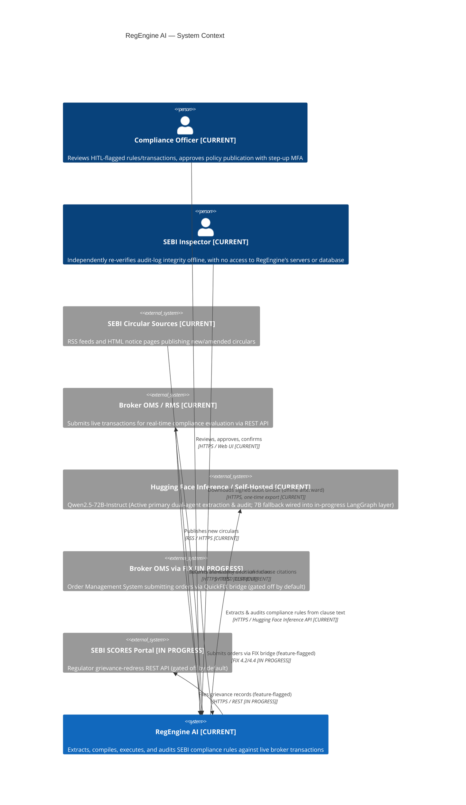
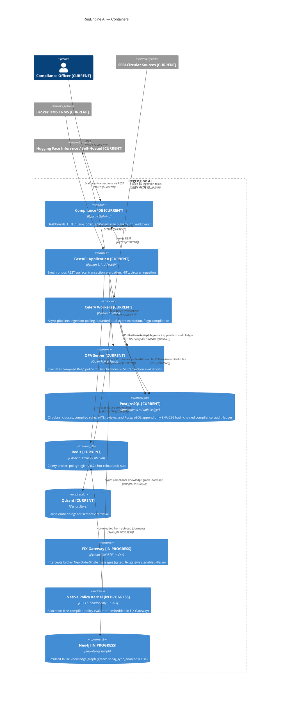
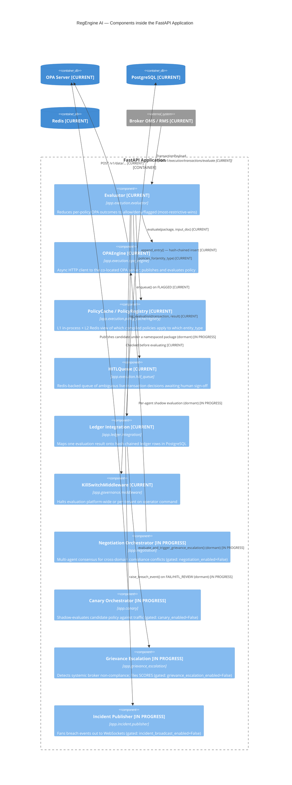
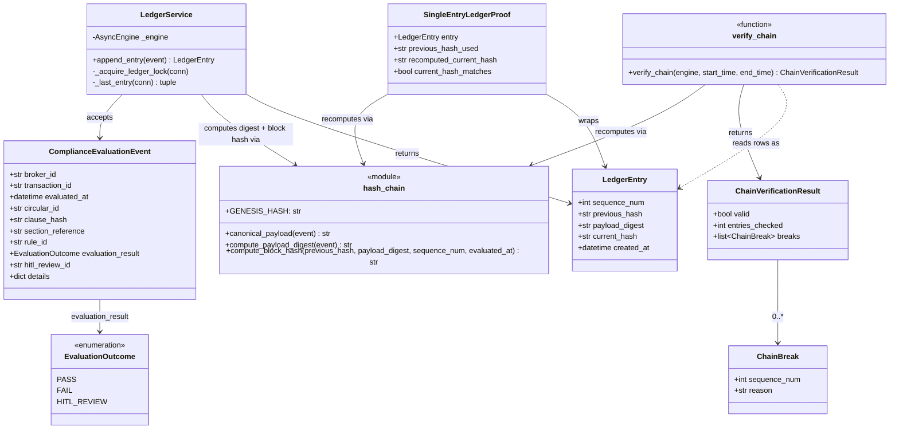
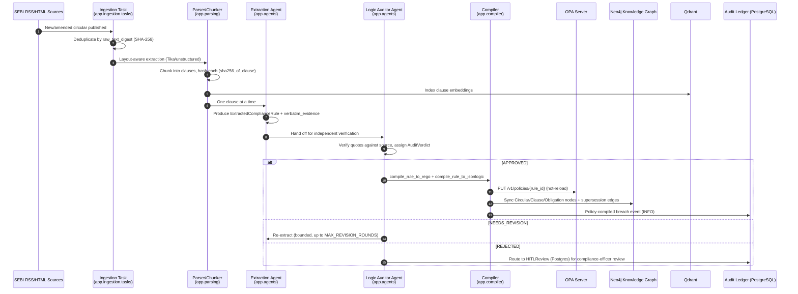
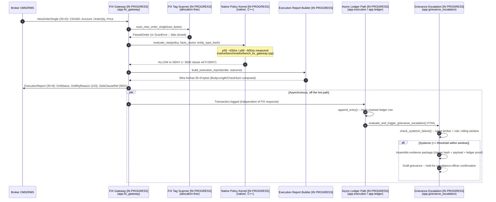

# RegEngine AI — C4 Model

Four levels (Context, Container, Component, Code) per the [C4 model](https://c4model.com/),
plus two supplementary sequence diagrams for the two flows called out
explicitly: SEBI RSS ingest, and broker OMS/FIX order validation. All
diagrams are Mermaid.js — GitHub, GitLab, and most IDE Markdown
previews render these fences natively with no extra tooling.

Every element is tagged with its explicit capability status per the RegEngine PRD:
- **`[CURRENT]`**: Implemented, integrated into the live production pipeline, and verified end-to-end.
- **`[IN PROGRESS]`**: Implemented in code, but decoupled/feature-flagged from the default production pipeline.
- **`[ROADMAP]`**: Proposed or design-stage capability; not implemented in code.

## Level 1 — System Context

Who and what RegEngine AI talks to, and why.

## Level 2 — Containers

The deployable units inside RegEngine AI's system boundary.

## Level 3 — Components (inside the FastAPI Application container)

Zooming into the container most requests actually traverse.

## Level 4 — Code (the audit-ledger hash-chain module)

The most safety-critical single module in the platform: PostgreSQL, append-only, SHA-256 hash-chained blocks, QLDB-journal-inspired design per [ADR-0003](../adr/0003-sha256-hash-chain-audit-log.md) (with no active AWS QLDB dependency), at class/function granularity.

## Supplementary — SEBI RSS Ingest Flow (Dynamic View)

## Supplementary — Broker OMS / FIX Order Validation Flow (Dynamic View) [`IN PROGRESS`]

> [!NOTE]
> This sequence represents the feature-flagged FIX Gateway and native C++ policy kernel (`app/fix_gateway/`, `native/`), which is an **`IN PROGRESS`** capability decoupled from the default production REST pipeline.

## Diagram-to-Source Cross-Reference

| Diagram Element | Source Module | Capability Status | Live Production Path? |
|---|---|:---:|:---:|
| **Evaluator / OPAEngine / HITLQueue** | `app/execution/` | **`CURRENT`** | **Yes** |
| **Ledger Integration / hash_chain / verify_chain** | `app/ledger/` | **`CURRENT`** | **Yes** |
| **Compiler (Rego + JSON-Logic)** | `app/compiler/rego_compiler.py`, `app/compiler/jsonlogic_compiler.py` | **`CURRENT`** | **Yes** |
| **Extraction + Logic Auditor Agents** | `app/agents/crew.py` (active sequential pipeline) | **`CURRENT`** | **Yes** |
| **Ingestion / Parsing** | `app/ingestion/`, `app/parsing/` | **`CURRENT`** | **Yes** |
| **Vector Store (Clause Embeddings)** | `app/vectorstore/` | **`CURRENT`** | **Yes** |
| **Dynamic LangGraph Orchestration** | `app/agents/graph/` (feature-flagged) | **`IN PROGRESS`** | **No** (flagged: `agent_graph_orchestration_enabled=False`) |
| **FIX Gateway / Native Policy Kernel** | `app/fix_gateway/`, `native/include/regengine/` | **`IN PROGRESS`** | **No** (flagged: `fix_gateway_enabled=False`) |
| **Negotiation Orchestrator** | `app/negotiation/` | **`IN PROGRESS`** | **No** (flagged: `negotiation_enabled=False`) |
| **Canary Orchestrator** | `app/canary/` | **`IN PROGRESS`** | **No** (flagged: `canary_enabled=False`) |
| **Grievance Escalation** | `app/grievance_escalation/` | **`IN PROGRESS`** | **No** (flagged: `grievance_escalation_enabled=False`) |
| **Incident Publisher / Dashboard** | `app/incident/` | **`IN PROGRESS`** | **No** (flagged: `incident_broadcast_enabled=False`) |
| **Knowledge Graph Sync (Neo4j)** | `app/graph/` | **`IN PROGRESS`** | **No** (flagged: `neo4j_sync_enabled=False`) |
| **Zero-Knowledge Proofs (ZKP)** | `app/zkp/` | **`IN PROGRESS`** | **No** (flagged: `zkp_enabled=False`) |
| **Historical Replay Backtesting** | `app/backtest/` | **`IN PROGRESS`** | **No** (standalone batch script) |
| **QLoRA Fine-Tuning Scaffolding** | `llm_finetune/` | **`IN PROGRESS`** | **No** (standalone training pipeline) |
| **Regulatory Filing Adapter** | `app/regulatory_filing/` | **`IN PROGRESS`** | **No** (flagged: `regulatory_filing_enabled=False`) |
| **Multilingual OCR & Translation** | `app/localization/`, `translation_parity/` | **`IN PROGRESS`** | **No** (flagged: `localization_enabled=False`) |
| **Regulatory Version Diffing** | `app/diffing/` | **`IN PROGRESS`** | **No** (standalone router) |
| **Compliance Case-Law Memory Agent** | N/A | **`ROADMAP`** | **No** (proposed; `memory=False` in live pipeline) |
| **Compliance-as-Collateral Protocol** | N/A | **`ROADMAP`** | **No** (proposed) |
| **Real-Data Rule-Impact Preview** | N/A | **`ROADMAP`** | **No** (proposed) |
| **M&A Compliance Due-Diligence Agent**| N/A | **`ROADMAP`** | **No** (proposed) |
| **Fine-Tuned Domain Model (`sebi-compliance-llm`)** | N/A | **`ROADMAP`** | **No** (proposed; scaffolding in `llm_finetune/`) |
| **Ingestion Velocity Benchmark Harness** | `benchmarks/` | **`ROADMAP`** | **No** (target: `<10 min`; benchmark harness pending) |

