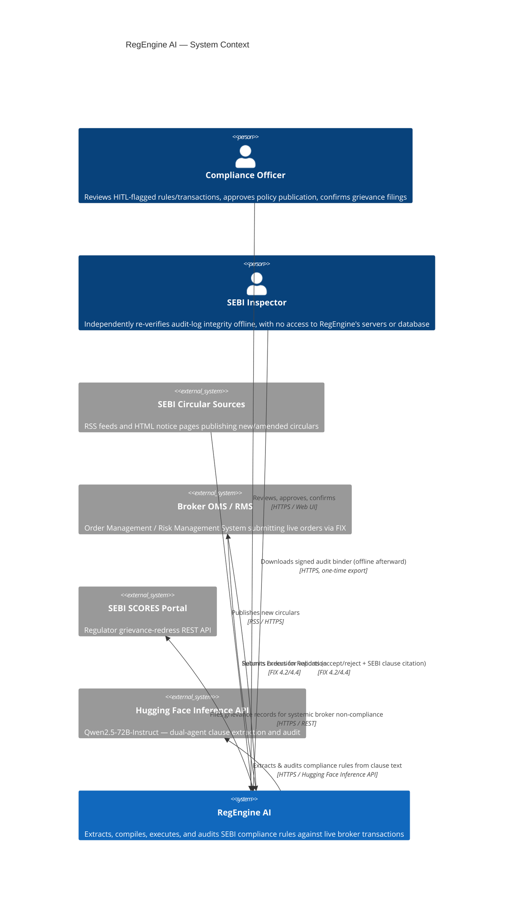
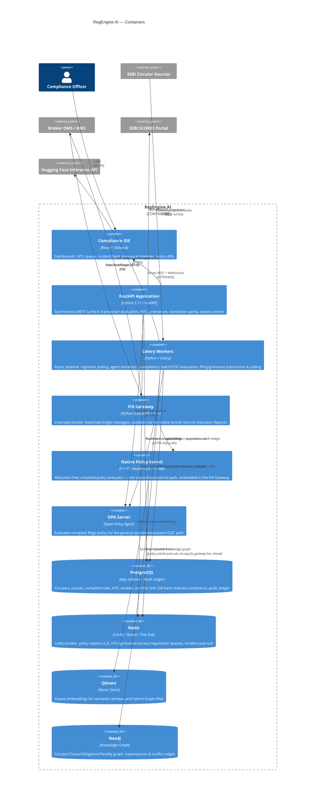
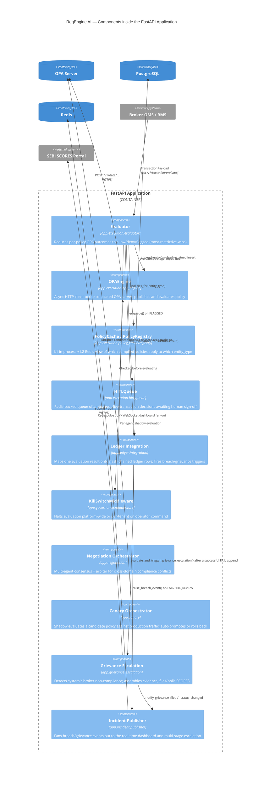
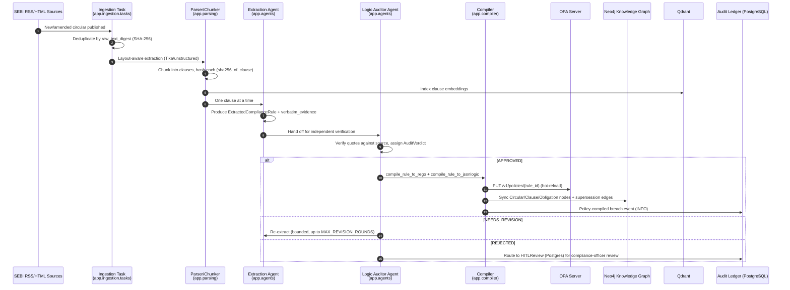
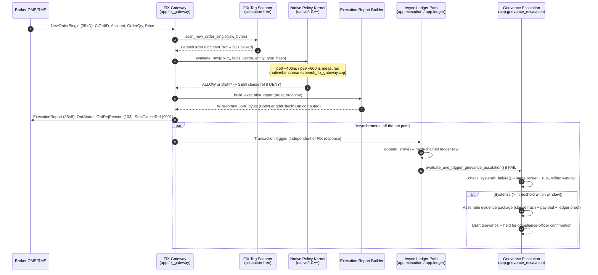

# RegEngine AI — C4 Model

Four levels (Context, Container, Component, Code) per the [C4 model](https://c4model.com/),
plus two supplementary sequence diagrams for the two flows called out
explicitly: SEBI RSS ingest, and broker OMS/FIX order validation. All
diagrams are Mermaid.js — GitHub, GitLab, and most IDE Markdown
previews render these fences natively with no extra tooling.

## Level 1 — System Context

Who and what RegEngine AI talks to, and why.

## Level 2 — Containers

The deployable units inside RegEngine AI's system boundary.

## Level 3 — Components (inside the FastAPI Application container)

Zooming into the container most requests actually traverse.

## Level 4 — Code (the audit-ledger hash-chain module)

The most safety-critical single module in the platform (ADR 0003), at
class/function granularity.

## Supplementary — SEBI RSS Ingest Flow (Dynamic View)

## Supplementary — Broker OMS / FIX Order Validation Flow (Dynamic View)

## Diagram-to-Source Cross-Reference

| Diagram element | Source module |
|---|---|
| FIX Gateway / Native Policy Kernel | `app/fix_gateway/`, `native/include/regengine/` |
| Evaluator / OPAEngine / HITLQueue | `app/execution/` |
| Ledger Integration / hash_chain / verify_chain | `app/ledger/` |
| Compiler (Rego + JSON-Logic) | `app/compiler/rego_compiler.py`, `app/compiler/jsonlogic_compiler.py` |
| Extraction + Logic Auditor Agents | `app/agents/crew.py`, `app/agents/graph/` |
| Negotiation Orchestrator | `app/negotiation/` |
| Canary Orchestrator | `app/canary/` |
| Grievance Escalation | `app/grievance_escalation/` |
| Incident Publisher / Dashboard | `app/incident/` |
| Knowledge Graph sync | `app/graph/` |
| Ingestion / Parsing | `app/ingestion/`, `app/parsing/` |
